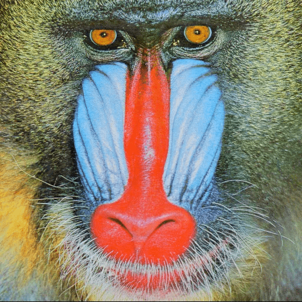
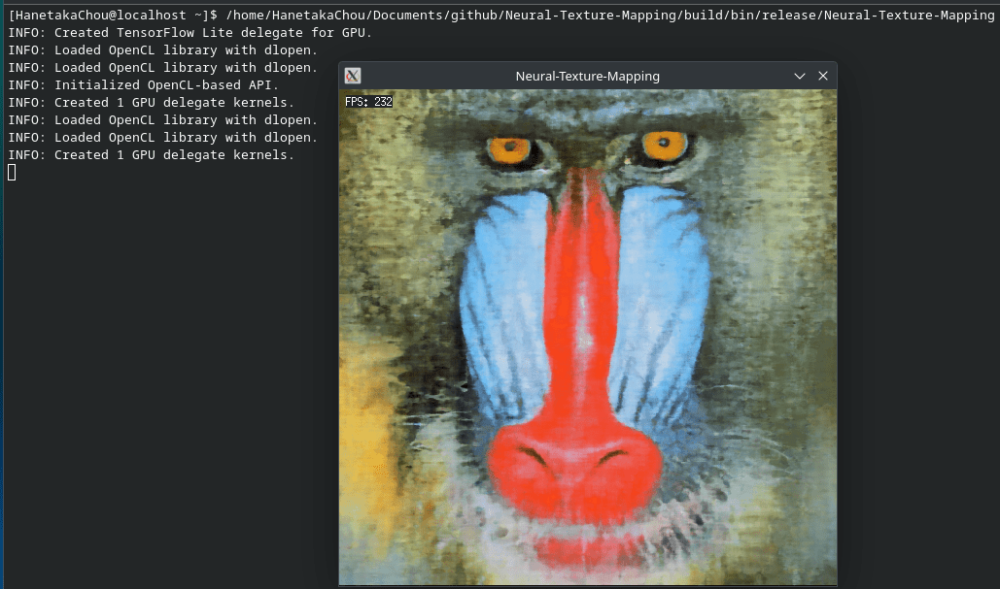
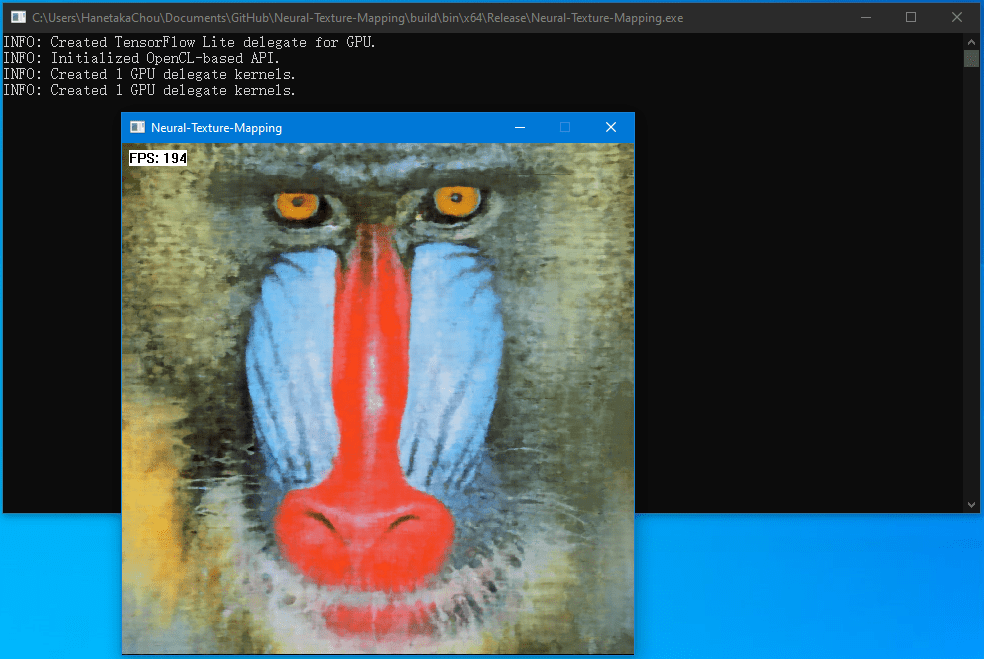

# Neural Texture Mapping  

  

  

TODO: In practice, it is much easier to train the model by TensorFlow, and then use the **keras.layers.get_weights** to output the coefficents of each layers of the trained model. These coefficents can be used directly to inference in [RTX Neural Shading](https://github.com/NVIDIA-RTX/RTXNS) (which is based on ([Direct3D12 Wave Matrix](https://microsoft.github.io/DirectX-Specs/d3d/HLSL_SM_6_x_WaveMatrix.html)) or ([Vulkan Cooperative Matrix](https://registry.khronos.org/vulkan/specs/latest/man/html/VK_KHR_cooperative_matrix.html))).  
 

## Potential Best Practice  

The inference shader source is fixed, and can be merely treated as the regular game engine material asset. And these coefficents can be merely treated as the regular game engine texture assets. And the TensorFlow, which is used to generate these coefficents, can be merely treated as the regular game DCC tool. Perhaps every artist will be able to use the TensorFlow in the future!   

### Neutral Texture Mapping Asset Format  

Note: the **coefficients** are composed of both the **weights** and the **bias**.  
 
Type | Description  
:-: | :-:  
uint32_t | FourCC('N', 'T', 'M', ' ')  
uint32_t | number of frequencies  
uint32_t | number of the texture mapping layers  
uint32_t | number of the coefficients of the 1st texture mapping layer  
float [ ] | coefficients of the 1st texture mapping layer  
uint32_t | number of the coefficients of the 2nd texture mapping layer  
float [ ] | coefficients of the 2nd texture mapping layer  
... | ...  

### Potential Application 

The size of the assets of the MMO can be higher than 100GB. If the size of the neutral texture assets can be less than the regular game texture assets, this technique can be useful. All the texture sampling operations can be replaced by inferencing from the coefficients buffers.  

### Potential Issue 

The texture cache is always highly optimized by the GPU ([for more information](https://hanetakachou.github.io/Console-Tutorial/Resource-Uploading.html)). Since we store the neutral texture assets in the buffers, the cache missing can be much higher. In addition, the mipmap level can not be easily supported.  

TODO: If we change the memory layout of the target texture according to the [AMD addrlib](https://gitlab.freedesktop.org/mesa/mesa/-/blob/22.3/src/amd/vulkan/radv_meta_bufimage.c#L1372) before we train the model, will the result of the trained model be better?  

## Target  

  

## Prediction  

  

  
